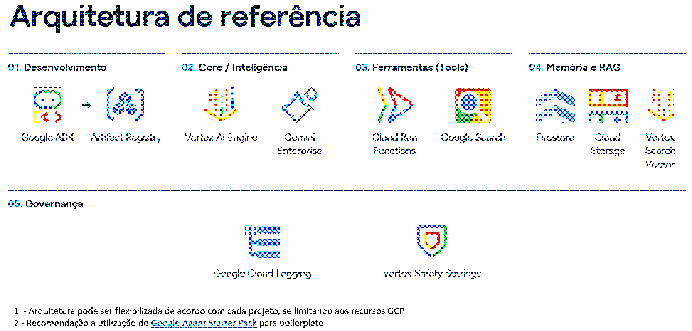

<!--
=====================================================================
 TEMPLATE DE README — Desafio de Agentes de IA · Mercado de Capitais
 GFT × Google · rumo à Semana de Mercado de Capitais 2026 (SMC26)
=====================================================================

 INSTRUÇÕES PARA A EQUIPE:
 - Este é um MODELO. Preencha todos os campos entre colchetes [ ... ]
   e apague os comentários (blocos de comentário) antes de submeter.
 - Não altere a estrutura de pastas descrita ao final — o time
   organizador espera encontrar os artefatos exatamente nesses
   diretórios.
 - Use APENAS dados mock, públicos ou sintéticos. É PROIBIDO usar
   dados reais de clientes, confidenciais ou sensíveis.
 - Confidencial — Uso Interno GFT.

=====================================================================

-->
# [NOME DO AGENTE]

> _[Uma frase de efeito que resume o que o agente faz — ex.: "Assistente de IA que monitora liquidez de fundos em tempo real."]_

**Desafio de Agentes de IA — Mercado de Capitais** Iniciativa DGCU07 + BDP em parceria com o Google · SMC26 (27 a 29 de outubro)

---

##  Equipe

|Papel|Nome|E-mail GFT|
|---|---|---|
|**Capitão**|Victor Rosa|vrmu@gft.com|
|Integrante|[Nome]|[email]|
|Integrante|[Nome]|[email]|
|Integrante|[Nome]|[email]|

**Nome da equipe:** [Nome do time]

<!-- Times de 1 a 4 pessoas. Remova as linhas de integrantes não utilizadas. -->

---

## 🎯 O Problema

<!-- 2 a 4 parágrafos. Que dor real de negócio o agente resolve? Qual o contexto no Mercado de Capitais? Quem sofre com esse problema hoje? -->

[Descreva o problema que o agente resolve.]

**Público-alvo:** [Quem usa / se beneficia do agente]

---

## 💡 A Solução

<!-- Explique o que o agente faz, como resolve o problema e por que a abordagem é adequada. Destaque criatividade e inovação. -->

[Descreva a solução em linguagem clara.]

### Principais Funcionalidades

- [Funcionalidade 1]
- [Funcionalidade 2]
- [Funcionalidade 3]

---

## 📊 Impacto

<!-- Qual o valor gerado? Sempre que possível, quantifique. -->

- **Eficiência:** [ex.: reduz em X% o tempo de análise de ...]
- **Redução de erros:** [ex.: elimina a etapa manual de ...]
- **Valor para o cliente / negócio:** [ex.: ...]

---

## Arquitetura

<!-- Insira aqui o diagrama da solução. Coloque o arquivo em /docs (ver estrutura ao final) e referencie a imagem abaixo (a imagem que está exibindo é apenas um exemplo para o link, não considere como modelo). -->



**Descrição do fluxo:** [Explique em poucas linhas como os componentes se conectam.]

---

## Stack Tecnológica

|Camada|Tecnologia|
|---|---|
|Plataforma de IA|Gemini Enterprise|
|Abordagem|[ Low-code (Agent Builder) / Code (Vertex AI + ADK) ]|
|Modelo(s)|[ex.: Gemini 2.5 Pro]|
|Recursos usados|[ex.: RAG, function calling, multi-agentes, Workspace]|
|Outras ferramentas|[ex.: Python, Sheets, Drive]|

<!-- O Gemini Enterprise é a ferramenta oficial de IA do desafio. Indique se seguiu a trilha low-code, code, ou ambas. -->

---

## ▶️ Demo

<!-- ENTREGÁVEL OBRIGATÓRIO: protótipo navegável ou simulado. -->

🔗 **Link da demo:** [URL do protótipo navegável / ambiente]

**Como executar localmente** _(se aplicável)_:

```bash
[comandos para rodar / instruções de acesso]
```

**Credenciais de teste** _(se aplicável)_: [usuário / senha mock]

---

## 🎥 Vídeo (Pitch + Demo)

<!-- ENTREGÁVEL OBRIGATÓRIO: vídeo com pitch + demonstração. O vídeo deve ser gravado no sharepoint da GFT ou dentro do próprio repositório (caso nao comporte, dividir em mais arquivos -->

🔗 **Link do vídeo:** [URL — Sharepoint ou pasta do gitlab, etc.]

⏱️ Duração: [ex.: 3 a 5 min]

---

## 📎 Artefatos Entregáveis

Todos os entregáveis obrigatórios do desafio estão organizados neste repositório conforme a tabela abaixo. **Preencha os links e confirme que cada arquivo está no diretório indicado.**

|Entregável|Formato|Onde está|Status|
|---|---|---|---|
|Demo funcional|Link / código|seção [Demo](https://claude.ai/chat/e9e1272b-c54e-4be6-b23f-7fced83f01ba#%EF%B8%8F-demo) + `/src`|☐|
|Vídeo (pitch + demo)|Link (MP4/URL)|seção [Vídeo](https://claude.ai/chat/e9e1272b-c54e-4be6-b23f-7fced83f01ba#-v%C3%ADdeo-pitch--demo) + `/docs/video/`|☐|
|One-pager (problema, solução, impacto)|**PDF**|`/docs/one-pager.pdf`|☐|
|Diagrama de arquitetura|**PDF** + imagem|`/docs/arquitetura.pdf` · `/docs/arquitetura.png`|☐|
|Apresentação (opcional)|PPT/PDF|`/docs/apresentacao.pptx`|☐|

<!-- Marque [x] quando cada item estiver pronto. A SUBMISSÃO FINAL no Forms pedirá: link da demo, link do vídeo, arquitetura (PDF) e one-pager (PDF). -->

---

## 📁 Estrutura do Repositório

<!-- INSTRUÇÕES DE ORGANIZAÇÃO DOS ARQUIVOS — leia com atenção. Grave cada tipo de artefato exatamente na pasta indicada abaixo. Isso padroniza a avaliação e facilita o trabalho do júri. -->

```
.
├── README.md                  ← este arquivo (o cartão de visita do agente)
│
├── src/                       ← CÓDIGO-FONTE do agente
│   ├── ...                       (scripts Python/ADK, configs do Agent Builder,
│   │                              prompts, exports de fluxo low-code, etc.)
│   └── requirements.txt          (dependências, se houver código)
│
├── data/                      ← DADOS mock / públicos / sintéticos
│   └── ...                       (⚠️ NUNCA dados reais, confidenciais ou sensíveis)
│
├── docs/                      ← DOCUMENTAÇÃO e artefatos de entrega
│   ├── one-pager.pdf             → PDF: problema, solução e impacto (OBRIGATÓRIO)
│   ├── arquitetura.pdf           → PDF: diagrama da arquitetura (OBRIGATÓRIO p/ Forms)
│   ├── arquitetura.png           → imagem do diagrama (referenciada no README)
│   ├── apresentacao.pptx         → PPT/slides do pitch (opcional)
│   ├── video/
│   │   └── link.md               → arquivo texto com o LINK do vídeo
│   │                               (ou o .mp4, se couber no repositório)
│   └── imagens/                  → prints de tela, GIFs, mockups da demo
│
└── LICENSE / NOTICE           ← propriedade intelectual da GFT; autoria dos participantes
```

### Onde gravar cada tipo de arquivo

- **Código e prompts** → `src/`. Inclua um `requirements.txt` ou instruções de setup se houver código executável.
- **Dados** → `data/`. Apenas mock, público ou sintético. Documente a origem/geração dos dados.
- **One-pager** → `docs/one-pager.pdf` (formato PDF).
- **Diagrama de arquitetura** → `docs/arquitetura.pdf` (para o Forms) e uma versão `.png` em `docs/` para exibir no README.
- **Apresentação / slides** → `docs/apresentacao.pptx` (ou PDF).
- **Vídeo** → prefira um **link** (Sharepoint GFT ou no próprio Gitlab) registrado em `docs/video/link.md`. Só suba o `.mp4` no repositório se o tamanho permitir (verificar a necessidade de dividir em arquivos menores)
- **Imagens, prints e GIFs** da demo → `docs/imagens/`.

---

## ✅ Checklist antes de submeter

- [ ] README preenchido (campos `[ ]` substituídos, comentários removidos)
- [ ] Demo funcional acessível pelo link
- [ ] Vídeo (pitch + demo) publicado e linkado
- [ ] One-pager em **PDF** em `docs/`
- [ ] Diagrama de arquitetura em **PDF** em `docs/`
- [ ] Somente dados mock/públicos/sintéticos no repositório
- [ ] Equipe e capitão preenchidos corretamente
- [ ] Formulário de **Submissão do Projeto** enviado (link demo, link vídeo, arquitetura PDF, one-pager PDF)
