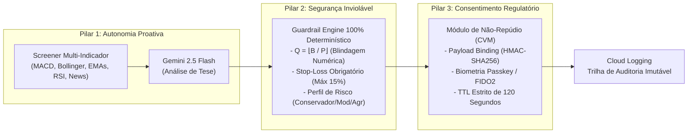

# GuardrailAI - Middleware B2B de Governança e Autonomia Proativa para Mercado de Capitais

> _"Middleware B2B que combina autonomia proativa de mercado (Gemini / Vertex AI) com motor de Guardrails 100% determinísticos, blindagem contra alucinações matemáticas e consentimento regulatório (CVM)."_

**Desafio de Agentes de IA — Mercado de Capitais**  
Iniciativa DGCU02 + BDP em parceria com o Google · SMC26

---

## 👥 Equipe

| Papel | Nome | E-mail GFT | Estrutura |
|---|---|---|---|
| **Capitão** | Victor Rosa | vrmu@gft.com | DGCU02 / BDP |

**Nome da equipe:** GuardrailAI

---

## 🎯 O Problema

As corretoras, instituições financeiras e investidores enfrentam um receio crítico em delegar a execução de ordens e análises de mercado a modelos de Inteligência Artificial generativa devido à imprevisibilidade e ao risco inerente de **alucinações matemáticas na leitura de preços e quantidades**.

Embora os modelos de linguagem (LLMs) possam sugerir alocações dinâmicas e oportunidades de mercado, correm o risco de **omitir parâmetros fundamentais de gestão de risco — como o preço de Stop-Loss —**, o que poderia expor o capital do cliente a prejuízos descontrolados.

Os sistemas tradicionais carecem de uma camada intermediária (*middleware*) robusta que combine uma **verificação determinística estrita** (recalculando tetos financeiros e limites de orçamento em código) com um **fluxo de consentimento regulatório auditável** e compatível com as normas da CVM.

---

## 💡 A Solução: GuardrailAI

O **GuardrailAI** atua como um middleware B2B de governança que desacopla a camada analítica de IA da camada determinística de risco e execução, estruturado em **3 Pilares Fundamentais**:

### 🏛️ Os 3 Pilares da Arquitetura



1. **Autonomia Proativa (Screener + ReAct & Blindagem Matemática):**  
   O utilizador define apenas o orçamento ($B$) e o perfil de risco. O agente varre autonomamente a watchlist da B3, processa indicadores técnicos avançados (MACD, Bollinger, Médias Rápidas/Lentas, RSI) e notícias. O motor de execução calcula deterministicamente a quantidade exata de ativos ($Q = \lfloor B/P \rfloor$), eliminando qualquer possibilidade de alucinação numérica da IA.

2. **Segurança Inviolável (Guardrail Engine 100% Determinístico):**  
   A IA atua de forma estritamente analítica e não envia ordens diretas à bolsa. Toda intenção em JSON é interceptada por uma camada determinística em código Python que bloqueia instantaneamente ordens sem Stop-Loss, com perda excessiva (> 15%) ou que violem os tetos de concentração da carteira.

3. **Consentimento Regulatório e Não-Repúdio (CVM):**  
   Operações financeiras geram uma solicitação com **Payload Binding Criptográfico (HMAC-SHA256)** inviolável e aprovação biométrica (**Passkey / FIDO2**) com **TTL estrito de 120 segundos**, garantindo não-repúdio e proteção contra variações bruscas de mercado.

---

## 🎯 Público-Alvo

- **Investidores Individuais (Varejo Alta Renda):** Utilizam o agente como um co-piloto no aplicativo da corretora ou do banco para gerenciar a carteira pessoal com automação na leitura de dados, dispensando a necessidade de acompanhar o mercado em tempo integral.
- **Escritórios de Investimento & Assessores (AAI):** Buscam o monitoramento contínuo da carteira de múltiplos clientes em paralelo, garantindo escala operacional e a capacidade de supervisionar centenas de carteiras sem perder a personalização.
- **Gestoras & Wealth Management:** Empregam a tecnologia na execução de rotinas de rebalanceamento e ajuste de fundos operados, obtendo precisão matemática na execução de regras de compliance e redução do viés operacional.

---

## 📊 Impacto de Negócio

- **Eficiência Operacional:** Reduz em mais de 90% o tempo necessário para varredura técnica de mercado e checagem de conformidade de ordens.
- **Eliminação de Risco (Zero Alucinações):** 100% das ordens passam por recálculo determinístico $Q = \lfloor B/P \rfloor$ e validação estrita de Stop-Loss antes de qualquer autorização.
- **Conformidade Regulatória Total:** Trilha imutável de auditoria com assinatura HMAC-SHA256 e consentimento biométrico com TTL de 120s para compliance com a CVM.

---

## 🏗️ Estrutura Modular do Projeto

O repositório é organizado em módulos desacoplados com ciclos de vida, testes e ambientes independentes, mantendo recursos e contratos compartilhados centralizados:

```
.
├── agent-python/                      # [MÓDULO] Agente de IA, Guardrails e Screener B3
│   ├── src/
│   │   ├── core/
│   │   │   ├── agent.py               # Integração cognitiva com Gemini 2.5 Flash (Vertex AI)
│   │   │   ├── guardrail.py           # Guardrail Determinístico Q = floor(B/P)
│   │   │   ├── consent.py             # Cliente de Consentimento REST & Payload Binding
│   │   │   ├── notifier.py            # Notificações WhatsApp / Webhooks
│   │   │   └── logger.py              # Cloud Logging estruturado
│   │   ├── tools/
│   │   │   ├── screener.py            # Coleta de Indicadores B3 (MACD, Bollinger, EMAs, RSI)
│   │   │   └── news_parser.py         # Parsing de notícias financeiras Google News RSS
│   │   └── main.py                    # Orquestrador do pipeline de governança
│   ├── tests/                         # Suíte de testes Pytest do agente
│   │   ├── test_guardrail.py          # Validação de regras e blindagem matemática
│   │   ├── test_consent.py            # Validação de HMAC, Passkey e TTL de 120s
│   │   ├── test_screener.py           # Validação dos indicadores técnicos
│   │   └── test_config.py             # Validação de argumentos e carregamento de lote
│   ├── Dockerfile                     # Container leve do Python Agent (Cloud Run Job)
│   ├── pytest.ini                     # Configuração Pytest
│   ├── requirements.txt               # Dependências Python isoladas
│   └── README.md                      # Instruções específicas do Agente Python
│
├── fido-server/                       # [MÓDULO] Servidor WebAuthn / Passkey (Java 21 / Spring Boot)
│   ├── src/
│   │   ├── main/
│   │   │   ├── java/com/guardrail/fido/
│   │   │   │   ├── controller/        # ConsentApiController.java
│   │   │   │   ├── model/             # ConsentChallenge.java
│   │   │   │   ├── service/           # ConsentService.java
│   │   │   │   └── FidoServerApplication.java
│   │   │   └── resources/
│   │   │       ├── application.yml    # Configurações do Spring Boot
│   │   │       └── static/consent.html # WebUI Biométrica WebAuthn / Passkey
│   │   └── test/                      # Testes unitários do servidor FIDO
│   ├── Dockerfile                     # Container multi-stage Java 21
│   ├── pom.xml                        # Configuração de dependências Maven
│   ├── mvnw / mvnw.cmd                # Maven Wrapper
│   └── README.md                      # Instruções específicas do Servidor FIDO
│
├── contracts/                         # [COMPARTILHADO] Schemas e Contratos REST Inter-Módulos
│   ├── consent-challenge.schema.json  # Schema formal JSON do Desafio de Consentimento
│   └── README.md                      # Especificação técnica do contrato de dados
│
├── config/                            # [COMPARTILHADO] Configurações de Carteiras e Clientes
│   └── clients.json                   # Watchlists, perfis de risco e orçamentos
│
├── docs/                              # [COMPARTILHADO] Documentação de Arquitetura
│   ├── arquitetura-referencia.png     # Diagrama visual dos 3 Pilares
│   └── ARCHITECTURE.md                # Especificação arquitetural completa
│
├── scripts/                           # [COMPARTILHADO] Automação, Deploy e Execução Local
│   ├── deploy_cloud_run.sh            # Script oficial de deploy no GCP Cloud Run Jobs
│   ├── run_local.sh                   # Inicializador conjunto local (Linux/WSL)
│   └── run_local.ps1                  # Inicializador conjunto local (Windows PowerShell)
│
├── docker-compose.yml                 # Orquestração local unificada (FIDO + Agent)
├── .env.example                       # Variáveis de ambiente recomendadas
└── README.md                          # Visão geral do ecossistema GuardrailAI
```

---

## ⚙️ Pré-requisitos

* **Python:** 3.12+ (ou 3.14 via WSL/Linux)
* **Java:** OpenJDK 21 (para compilar/executar o `fido-server`)
* **Google Cloud SDK (`gcloud`)** autenticado (para deploy em nuvem)
* **Docker & Docker Compose** (opcional para execução conteinerizada)

---

## 🚀 Como Executar

### Opção 1: Execução Completa Integrada com 1 Comando (Recomendado)

- **No Linux / WSL / macOS:**
  ```bash
  ./scripts/run_local.sh
  ```

- **No Windows (PowerShell):**
  ```powershell
  .\scripts\run_local.ps1
  ```

- **Via Docker Compose:**
  ```bash
  docker compose up --build
  ```

---

### Opção 2: Execução Independente por Módulo

#### 🐍 Módulo Python (`agent-python`)
```bash
cd agent-python
source .venv/bin/activate  # ou .venv\Scripts\activate no Windows

# Rodar testes automatizados:
pytest -v

# Executar pipeline de governança:
python src/main.py --config ../config/clients.json
```

#### ☕ Módulo Java (`fido-server`)
```bash
cd fido-server

# Rodar testes:
./mvnw test

# Iniciar servidor Spring Boot (porta 8080):
./mvnw spring-boot:run
```

---

## ☁️ Deploy no Google Cloud (Cloud Run Jobs)

### 🚀 Deploy Automatizado do Agente com 1 Comando

```bash
./scripts/deploy_cloud_run.sh
```

---

### 🛠️ Deploy Manual do Container Python

```bash
# 1. Autenticar o Docker com o Artifact Registry do Google Cloud
gcloud auth configure-docker us-central1-docker.pkg.dev --quiet

# 2. Construir a imagem a partir de agent-python
docker build -t us-central1-docker.pkg.dev/gft-brazil-bu-gcp/repo-guardrailai/guardrail-agent:latest ./agent-python

# 3. Enviar a imagem para o Artifact Registry
docker push us-central1-docker.pkg.dev/gft-brazil-bu-gcp/repo-guardrailai/guardrail-agent:latest

# 4. Criar ou atualizar o Cloud Run Job
gcloud run jobs deploy guardrail-agent-job \
  --image us-central1-docker.pkg.dev/gft-brazil-bu-gcp/repo-guardrailai/guardrail-agent:latest \
  --region us-central1 \
  --set-env-vars="CLIENTS_CONFIG_FILE=config/clients.json" \
  --memory=1Gi \
  --cpu=1
```

### 🧪 Execução na Nuvem

```bash
gcloud run jobs execute guardrail-agent-job --region us-central1
```

