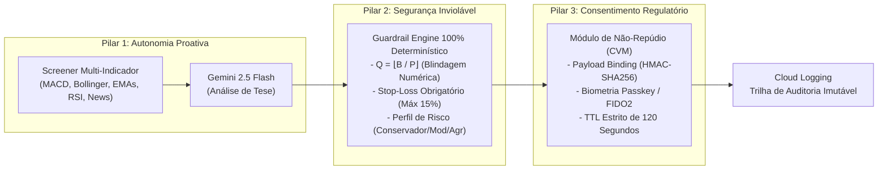

# GuardrailAI - Middleware B2B de Governança e Autonomia Proativa para Mercado de Capitais

> _"Middleware B2B que combina autonomia proativa de mercado (Gemini / Vertex AI) com motor de Guardrails 100% determinísticos, blindagem contra alucinações matemáticas e consentimento regulatório (CVM)."_

**Desafio de Agentes de IA — Mercado de Capitais**  
Iniciativa DGCU02 + BDP em parceria com o Google · SMC26

---

## 👥 Equipe

| Papel | Nome | E-mail GFT | Estrutura |
|---|---|---|---|
| **Capitão** | Victor Rosa | vrmu@gft.com | DGCU02 / BDP |

**Nome da equipe:** GuardrailAI

---

## 🎯 O Problema

As corretoras, instituições financeiras e investidores enfrentam um receio crítico em delegar a execução de ordens e análises de mercado a modelos de Inteligência Artificial generativa devido à imprevisibilidade e ao risco inerente de **alucinações matemáticas na leitura de preços e quantidades**.

Embora os modelos de linguagem (LLMs) possam sugerir alocações dinâmicas e oportunidades de mercado, correm o risco de **omitir parâmetros fundamentais de gestão de risco — como o preço de Stop-Loss —**, o que poderia expor o capital do cliente a prejuízos descontrolados.

Os sistemas tradicionais carecem de uma camada intermediária (*middleware*) robusta que combine uma **verificação determinística estrita** (recalculando tetos financeiros e limites de orçamento em código) com um **fluxo de consentimento regulatório auditável** e compatível com as normas da CVM.

---

## 💡 A Solução: GuardrailAI

O **GuardrailAI** atua como um middleware B2B de governança que desacopla a camada analítica de IA da camada determinística de risco e execução, estruturado em **3 Pilares Fundamentais**:

### 🏛️ Os 3 Pilares da Arquitetura



1. **Autonomia Proativa (Screener + ReAct & Blindagem Matemática):**  
   O utilizador define apenas o orçamento ($B$) e o perfil de risco. O agente varre autonomamente a watchlist da B3, processa indicadores técnicos avançados (MACD, Bollinger, Médias Rápidas/Lentas, RSI) e notícias. O motor de execução calcula deterministicamente a quantidade exata de ativos ($Q = \lfloor B/P \rfloor$), eliminando qualquer possibilidade de alucinação numérica da IA.

2. **Segurança Inviolável (Guardrail Engine 100% Determinístico):**  
   A IA atua de forma estritamente analítica e não envia ordens diretas à bolsa. Toda intenção em JSON é interceptada por uma camada determinística em código Python que bloqueia instantaneamente ordens sem Stop-Loss, com perda excessiva (> 15%) ou que violem os tetos de concentração da carteira.

3. **Consentimento Regulatório e Não-Repúdio (CVM):**  
   Operações financeiras geram uma solicitação com **Payload Binding Criptográfico (HMAC-SHA256)** inviolável e aprovação biométrica (**Passkey / FIDO2**) com **TTL estrito de 120 segundos**, garantindo não-repúdio e proteção contra variações bruscas de mercado.

---

## 🎯 Público-Alvo

- **Investidores Individuais (Varejo Alta Renda):** Utilizam o agente como um co-piloto no aplicativo da corretora ou do banco para gerenciar a carteira pessoal com automação na leitura de dados, dispensando a necessidade de acompanhar o mercado em tempo integral.
- **Escritórios de Investimento & Assessores (AAI):** Buscam o monitoramento contínuo da carteira de múltiplos clientes em paralelo, garantindo escala operacional e a capacidade de supervisionar centenas de carteiras sem perder a personalização.
- **Gestoras & Wealth Management:** Empregam a tecnologia na execução de rotinas de rebalanceamento e ajuste de fundos operados, obtendo precisão matemática na execução de regras de compliance e redução do viés operacional.

---

## 📊 Impacto de Negócio

- **Eficiência Operacional:** Reduz em mais de 90% o tempo necessário para varredura técnica de mercado e checagem de conformidade de ordens.
- **Eliminação de Risco (Zero Alucinações):** 100% das ordens passam por recálculo determinístico $Q = \lfloor B/P \rfloor$ e validação estrita de Stop-Loss antes de qualquer autorização.
- **Conformidade Regulatória Total:** Trilha imutável de auditoria com assinatura HMAC-SHA256 e consentimento biométrico com TTL de 120s para compliance com a CVM.

---

## 🏗️ Estrutura do Projeto

```
.
├── src/
│   ├── core/
│   │   ├── agent.py       # Integração cognitiva com Gemini 2.5 Flash (Vertex AI)
│   │   ├── consent.py     # Pilar 3: Consentimento Regulatório, Payload Binding & TTL 120s
│   │   ├── guardrail.py   # Pilar 1 e 2: Motor Determinístico de Risco e Q = floor(B/P)
│   │   └── logger.py      # Emissão de logs estruturados (Cloud Logging)
│   ├── tools/
│   │   ├── screener.py    # Coleta de mercado (MACD, Bollinger, EMAs, RSI via yfinance)
│   │   └── news_parser.py # Coleta e parsing de notícias via Google News RSS
│   └── main.py            # Orquestrador do pipeline de ponta a ponta
├── tests/
│   ├── test_guardrail.py  # Testes de regras de risco e blindagem matemática
│   ├── test_consent.py    # Testes de Payload Binding HMAC, Passkey e TTL de 120s
│   └── test_screener.py   # Testes dos indicadores técnicos avançados
├── pytest.ini             # Configuração da suíte de testes
├── Dockerfile             # Container para Cloud Run Job
└── requirements.txt       # Dependências Python do projeto
```

---

## ⚙️ Pré-requisitos

* Python 3.12+ (ou 3.14 via WSL)
* Google Cloud SDK (`gcloud`) autenticado
* Projeto GCP com Vertex AI, Cloud Run e Cloud Logging habilitados

---

## 🚀 Como Executar Localmente

1. **Ative o ambiente virtual:**
   ```bash
   source .venv/bin/activate
   ```

2. **Execute a suíte completa de testes automatizados:**
   ```bash
   pytest -v
   ```

3. **Execute o pipeline principal de governança:**

   - **Modo Padrão (Cliente Único):**
     ```bash
     python src/main.py
     ```

   - **Modo Dinâmico via CLI:**
     ```bash
     python src/main.py --client-id "investidor_vip_007" --budget 12000 --risk "AGGRESSIVE" --watchlist "PETR4.SA,VALE3.SA,ITUB4.SA"
     ```

   - **Modo Lote Multi-Carteiras (AAI / Gestoras de Wealth Management):**
     ```bash
     python src/main.py --config config/clients.json
     ```

---

## ☁️ Deploy no Google Cloud (Cloud Run Jobs)

### 🚀 Deploy Automatizado com 1 Comando (Recomendado)

```bash
./scripts/deploy_cloud_run.sh
```

---

### 🛠️ Deploy Manual Passo a Passo (Docker Local)

```bash
# 1. Autenticar o Docker com o Artifact Registry do Google Cloud
gcloud auth configure-docker us-central1-docker.pkg.dev --quiet

# 2. Construir a imagem localmente
docker build -t us-central1-docker.pkg.dev/gft-brazil-bu-gcp/repo-guardrailai/guardrail-agent:latest .

# 3. Enviar a imagem para o repositório da equipe
docker push us-central1-docker.pkg.dev/gft-brazil-bu-gcp/repo-guardrailai/guardrail-agent:latest

# 4. Criar ou atualizar o Cloud Run Job apontando para a imagem
gcloud run jobs deploy guardrail-agent-job \
  --image us-central1-docker.pkg.dev/gft-brazil-bu-gcp/repo-guardrailai/guardrail-agent:latest \
  --region us-central1 \
  --set-env-vars="CLIENTS_CONFIG_FILE=config/clients.json" \
  --memory=1Gi \
  --cpu=1
```

### 🧪 Como Executar na Nuvem

- **Execução Manual:**
  ```bash
  gcloud run jobs execute guardrail-agent-job --region us-central1
  ```
