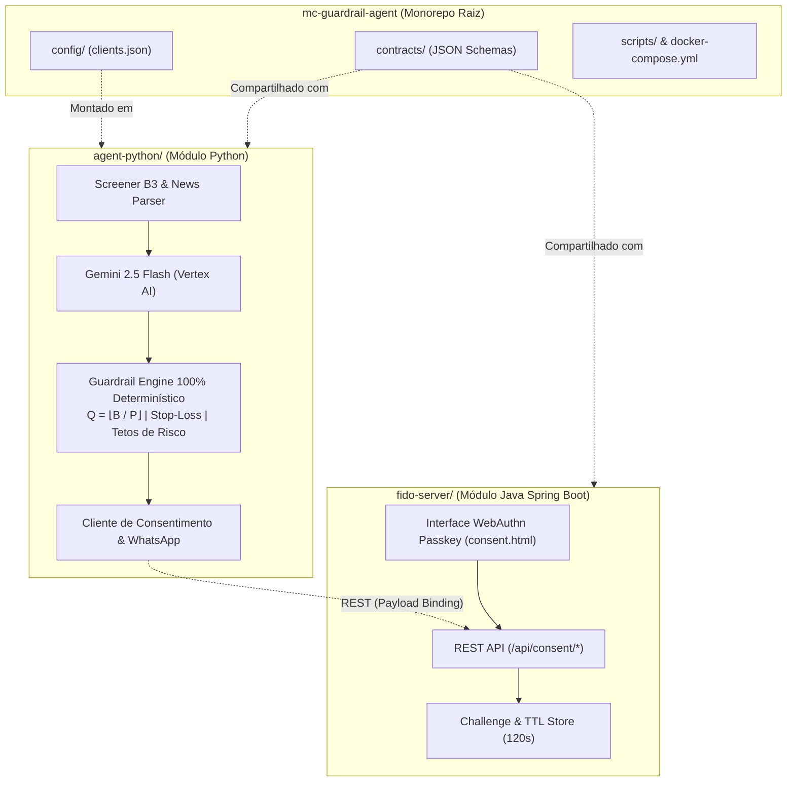

# GuardrailAI - Arquitetura de Referência e Módulos

O **GuardrailAI** é estruturado como um middleware B2B de governança que desacopla a inteligência analítica de IA da execução determinística de ordens e do consentimento regulatório (CVM).

---

## 🏛️ Divisão em Módulos Independentes

---

## 🛡️ Os 3 Pilares Fundamentais

1. **Pilar 1: Autonomia Proativa e Screener Multi-Indicador**
   - Coleta de dados técnicos da B3: MACD, Bandas de Bollinger, EMAs (9, 21, 50, 200) e RSI.
   - Análise de sentimento com Google News RSS.
   - Raciocínio contextualizado com Gemini 2.5 Flash.

2. **Pilar 2: Segurança Inviolável (Guardrail Determinístico)**
   - **Blindagem Numérica:** $Q = \lfloor B / P \rfloor$ recalculada estritamente em código.
   - **Stop-Loss Obrigatório:** Nenhuma ordem sem stop-loss ou com stop incoerente é aprovada.
   - **Perfis de Risco:** Tetos de 20% (Conservador), 35% (Moderado) e 50% (Agressivo).

3. **Pilar 3: Consentimento Regulatório e Não-Repúdio (CVM)**
   - **Payload Binding Criptográfico:** HMAC-SHA256 vinculando a ordem ao desafio.
   - **Janela Estrita de 120s:** TTL controlado pelo servidor FIDO Java.
   - **Biometria Passkey/FIDO2:** Autorização biométrica segura via WebAuthn no smartphone/computador do investidor.
