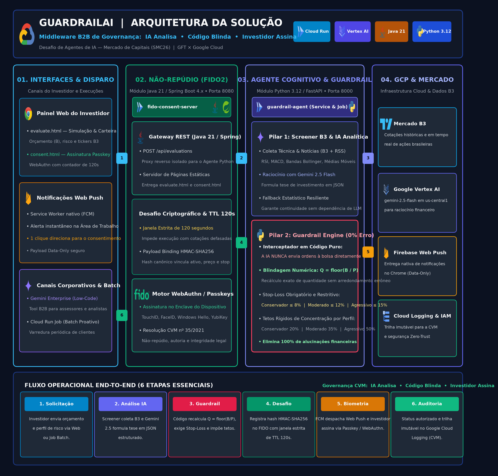
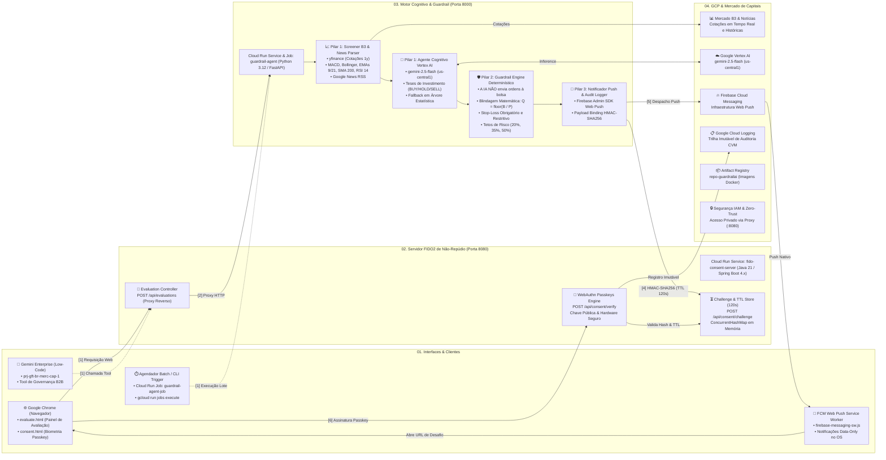

# GuardrailAI — Arquitetura de Referência & Middleware B2B de Governança

## Desafio de Agentes de IA · Mercado de Capitais (GFT × Google Cloud · SMC26)

O **GuardrailAI** é estruturado como um middleware B2B de governança financeira que desacopla a inteligência analítica de IA da execução determinística de ordens e do consentimento regulatório exigido pela Comissão de Valores Mobiliários (**CVM**).

A solução resolve o dilema fundamental da aplicação de modelos generativos no mercado de capitais: **a IA analisa e recomenda teses de investimento, o motor matemático em código puro blinda as regras de risco, e o investidor assina biometricamente com não-repúdio.**

---

## 🏛️ Diagrama da Arquitetura da Solução

> 📄 **Documento Vetorial:** O diagrama também está disponível em formato vetorial de alta definição para impressão e auditoria em **[`docs/arquitetura.pdf`](arquitetura.pdf)**.

---

## 🧭 Visão Estrutural e Topologia de Componentes

```mermaid
flowchart LR
    subgraph Layer1 ["01. Interfaces & Clientes"]
        direction TB
        ChromeWeb["🌐 Google Chrome (Navegador)<br/>• evaluate.html (Painel de Avaliação)<br/>• consent.html (Biometria Passkey)"]
        FCMClient["🔔 FCM Web Push Service Worker<br/>• firebase-messaging-sw.js<br/>• Notificações Data-Only no OS"]
        GeminiEnt["🤖 Gemini Enterprise (Low-Code)<br/>• prj-gft-br-merc-cap-1<br/>• Tool de Governança B2B"]
        BatchJob["⏱️ Agendador Batch / CLI Trigger<br/>• Cloud Run Job: guardrail-agent-job<br/>• gcloud run jobs execute"]
    end

    subgraph Layer2 ["02. Servidor FIDO2 de Não-Repúdio (Porta 8080)"]
        direction TB
        CR_Fido["Cloud Run Service: fido-consent-server (Java 21 / Spring Boot 4.x)"]
        FidoAPI["🚪 Evaluation Controller<br/>POST /api/evaluations (Proxy Reverso)"]
        ChallengeStore["⏳ Challenge & TTL Store (120s)<br/>POST /api/consent/challenge<br/>ConcurrentHashMap em Memória"]
        WebAuthnEngine["🔐 WebAuthn Passkeys Engine<br/>POST /api/consent/verify<br/>Chave Pública & Hardware Seguro"]
    end

    subgraph Layer3 ["03. Motor Cognitivo & Guardrail (Porta 8000)"]
        direction TB
        CR_Agent["Cloud Run Service & Job: guardrail-agent (Python 3.12 / FastAPI)"]
        Screener["📈 Pilar 1: Screener B3 & News Parser<br/>• yfinance (Cotações 1y)<br/>• MACD, Bollinger, EMAs 9/21, SMA 200, RSI 14<br/>• Google News RSS"]
        CognitiveAgent["🧠 Pilar 1: Agente Cognitivo Vertex AI<br/>• gemini-2.5-flash (us-central1)<br/>• Teses de Investimento (BUY/HOLD/SELL)<br/>• Fallback em Árvore Estatística"]
        GuardrailEngine["🛡️ Pilar 2: Guardrail Engine Determinístico<br/>• A IA NÃO envia ordens à bolsa<br/>• Blindagem Matemática: Q = floor(B / P)<br/>• Stop-Loss Obrigatório e Restritivo<br/>• Tetos de Risco (20%, 35%, 50%)"]
        PushNotifier["📡 Pilar 3: Notificador Push & Audit Logger<br/>• Firebase Admin SDK Web Push<br/>• Payload Binding HMAC-SHA256"]
    end

    subgraph Layer4 ["04. GCP & Mercado de Capitais"]
        direction TB
        B3Mkt["📊 Mercado B3 & Notícias<br/>Cotações em Tempo Real e Históricas"]
        VertexCloud["☁️ Google Vertex AI<br/>gemini-2.5-flash (us-central1)"]
        FCMCloud["🔥 Firebase Cloud Messaging<br/>Infraestrutura Web Push"]
        LoggingCloud["📋 Google Cloud Logging<br/>Trilha Imutável de Auditoria CVM"]
        RegistryCloud["📦 Artifact Registry<br/>repo-guardrailai (Imagens Docker)"]
        ZeroTrust["🔒 Segurança IAM & Zero-Trust<br/>Acesso Privado via Proxy (:8080)"]
    end

    %% Conexões do Fluxo
    ChromeWeb -->|"[1] Requisição Web"| FidoAPI
    GeminiEnt -.->|"[1] Chamada Tool"| FidoAPI
    BatchJob -.->|"[1] Execução Lote"| CR_Agent
    FidoAPI -->|"[2] Proxy HTTP"| CR_Agent
    CR_Agent --> Screener
    Screener -->|Cotações| B3Mkt
    Screener --> CognitiveAgent
    CognitiveAgent <-->|Inference| VertexCloud
    CognitiveAgent --> GuardrailEngine
    GuardrailEngine --> PushNotifier
    PushNotifier -->|"[4] HMAC-SHA256 (TTL 120s)"| ChallengeStore
    PushNotifier -->|"[5] Despacho Push"| FCMCloud
    FCMCloud -->|Push Nativo| FCMClient
    FCMClient -->|Abre URL de Desafio| ChromeWeb
    ChromeWeb -->|"[6] Assinatura Passkey"| WebAuthnEngine
    WebAuthnEngine -->|Valida Hash & TTL| ChallengeStore
    WebAuthnEngine -->|Registro Imutável| LoggingCloud
```

---

## 🧩 Detalhamento das 4 Camadas da Arquitetura

### 01. Camada de Interfaces & Clientes (Entrada & Disparo)
- **Painel de Avaliação de Carteira (`evaluate.html`):**
  - Servido estaticamente pelo servidor FIDO na porta 8080.
  - Permite seleção de perfis de investidores (`CLI-001`, `CLI-002`, `CLI-003`), orçamento disponível ($B$) e watchlist da B3.
  - Submete requisições assíncronas para auditoria determinística e apresenta o feedback visual das ordens (Aprovada, Ajustada por Guardrail ou Rejeitada).
- **Tela de Consentimento Biométrico (`consent.html`):**
  - Recebe o identificador do desafio (`challengeId`) via URL parameter ou evento push.
  - Exibe os detalhes consolidados da ordem autorizada: ticker, quantidade calculada, preço unitário, Stop-Loss validado e hash criptográfico HMAC-SHA256.
  - Apresenta o **contador regressivo estrito de TTL de 120 segundos**, bloqueando a assinatura caso a janela expire.
  - Executa a cerimônia WebAuthn nativa com os autenticadores do dispositivo (TouchID, FaceID, Windows Hello ou chaves de segurança FIDO2).
- **Service Worker de Web Push (`firebase-messaging-sw.js`):**
  - Registrado no navegador Google Chrome para recebimento de eventos push em background.
  - Opera no modo **Data-Only Payload**, garantindo que a notificação nativa do sistema operacional seja criada sob demanda com os dados da ordem pendente, direcionando o investidor com 1 clique para a tela de consentimento.
- **Gemini Enterprise (Low-Code):**
  - Hospedado no projeto GCP `prj-gft-br-merc-cap-1`.
  - Conecta-se à API do GuardrailAI como uma ferramenta de governança corporativa (*Tool Calling*), permitindo que assessores solicitem rebalanceamentos conversacionais com segurança.
- **Agendador Batch / Cloud Run Jobs:**
  - `guardrail-agent-job`: Execução em lote disparada periodicamente via Cloud Scheduler ou manualmente via `gcloud run jobs execute`.
  - Varre carteiras de clientes de forma proativa, analisa indicadores de mercado e dispara notificações push instantâneas quando oportunidades são validadas pelo guardrail.

---

### 02. Camada de Consentimento & Não-Repúdio (FIDO Server Java)
- **Tecnologia & Hospedagem:**
  - Desenvolvido em **Java 21** com framework **Spring Boot 4.x**.
  - Executado no Google Cloud Run como serviço privado: `fido-consent-server` (Porta 8080).
- **Evaluation Controller (`/api/evaluations`):**
  - Atua como API Gateway e proxy reverso para o backend analítico Python, isolando o serviço cognitivo de acessos externos diretos.
- **Challenge Store & Motor de TTL (120 segundos):**
  - Armazena desafios pendentes em memória isolada e de alta concorrência (`ConcurrentHashMap`).
  - Cada desafio possui um Nonce criptográfico único, timestamp de criação e janela de expiração rígida de 120s.
  - **Mitigação de Risco Sistêmico:** Impede que ordens aprovadas sejam assinadas após alterações bruscas de preços na B3.
  - Estados do Desafio: `PENDING` $\rightarrow$ `AUTHORIZED` ou `EXPIRED`.
- **Validação de Payload Binding Criptográfico (HMAC-SHA256):**
  - Valida o hash canônico gerado pelo Guardrail Engine, assegurando que o investidor assine exatamente os parâmetros auditados (ativo, quantidade, preço e stop-loss), sem possibilidade de adulteração em trânsito (*Man-In-The-Middle*).
- **WebAuthn / Passkeys Engine:**
  - Gera desafios criptográficos no endpoint `POST /api/consent/challenge` e valida assinaturas digitais assimétricas em `POST /api/consent/verify`.
  - Utiliza o enclave de hardware seguro do dispositivo do usuário (Secure Enclave / TPM).
  - Garante conformidade estrita com a **Resolução CVM nº 35/2021**, assegurando **autoria inequívoca, integridade e não-repúdio regulatório**.

---

### 03. Camada Cognitiva & Motor Determinístico (Agent Python)
- **Tecnologia & Hospedagem:**
  - Desenvolvido em **Python 3.12** com framework **FastAPI**.
  - Executado no Google Cloud Run como serviço (`guardrail-agent-service`) e como job batch (`guardrail-agent-job`) na porta 8000.
- **Pilar 1 — Screener B3 & News Parser:**
  - Coleta histórico de 1 ano de cotações diárias e intradiárias da B3 via `yfinance` e `pandas`.
  - Processa indicadores técnicos com a biblioteca `ta`:
    - **RSI (14 períodos):** Identificação de sobrecompra e sobrevenda.
    - **MACD (12, 26, 9):** Cruzamento de médias e momento da tendência.
    - **Bandas de Bollinger (20, 2):** Volatilidade e compressão de bandas.
    - **Médias Móveis:** EMA 9, EMA 21, SMA 20 e SMA 200 (Tendência de longo prazo).
  - Coleta manchetes recentes e feeds financeiros via Google News RSS para análise contextual de sentimento.
- **Pilar 1 — Raciocínio Cognitivo com Gemini 2.5 Flash:**
  - Integração nativa com a **Google Vertex AI** via SDK oficial `google-genai` na região `us-central1`.
  - Prompt com *System Instructions* especializadas em análise quantitativa e fundamentalista.
  - Gera teses de investimento estruturadas em JSON com recomendações (`BUY`, `HOLD`, `SELL`) e sugestão preliminar de volume e Stop-Loss.
  - **Fallback Determinístico Resiliente:** Caso o provedor de LLM apresente indisponibilidade ou latência, uma árvore de decisão técnica estatística assume a análise sem interromper o fluxo de negócios.
- **Pilar 2 — Guardrail Engine 100% Determinístico (0% de Erro):**
  - **A IA NUNCA envia ordens à bolsa diretamente.**
  - **Blindagem Numérica:** A quantidade a ser comprada é recalculada estritamente em código puro com a fórmula inviolável:
    $$Q = \left\lfloor \frac{B}{P} \right\rfloor$$
    Onde $B$ é o orçamento disponível para o ativo e $P$ é o preço atual de mercado da cotação B3.
  - **Stop-Loss Obrigatório e Restritivo:** Nenhuma ordem de compra é aprovada sem stop-loss. Propostas com stop ausente, invertido ou excessivo são automaticamente corrigidas ou rejeitadas:
    - **Conservador:** Perda máxima permitida $\le 8\%$ | Teto de concentração por ativo: $20\%$.
    - **Moderado:** Perda máxima permitida $\le 12\%$ | Teto de concentração por ativo: $35\%$.
    - **Agressivo:** Perda máxima permitida $\le 15\%$ | Teto de concentração por ativo: $50\%$.
  - Elimina 100% das alucinações de escala de valores, preços inexistentes e quantidades financeiramente inviáveis.
- **Pilar 3 — Notificador Push & Client FIDO:**
  - Inicializa o **Firebase Admin SDK** para disparo de Web Push diretamente ao browser Chrome do investidor.
  - Registra o desafio criptográfico com Payload Binding no servidor FIDO via chamada REST síncrona.
  - Emite logs estruturados em formato JSON com métricas de governança.

---

### 04. Camada de Infraestrutura em Nuvem & Mercado B3
- **Google Cloud Run (Services & Jobs):**
  - Plataforma serverless de contêineres gerenciados com autoscaling e isolamento de processos.
- **Google Cloud Vertex AI:**
  - Ambiente gerenciado de inferência de LLMs corporativos na região `us-central1`.
- **Firebase Cloud Messaging (FCM):**
  - Mensageria push de baixa latência conectada ao Service Worker do Chrome.
- **Google Cloud Logging:**
  - Repositório central de logs estruturados imutáveis para auditoria contínua e compliance CVM.
- **Google Artifact Registry:**
  - Repositório privado `repo-guardrailai` armazenando as imagens de contêiner Docker autenticadas.
- **Arquitetura Zero-Trust de Identidade:**
  - Serviços configurados sem permissão pública `allUsers`. O acesso seguro ocorre exclusivamente via Google Cloud IAM ou através de túnel seguro com `gcloud run services proxy fido-consent-server --port=8080`.

---

## 🔄 Fluxo Operacional End-to-End (Os 6 Passos Regulatórios)

| Passo | Etapa | Descrição Detalhada | Componente Responsável |
|---|---|---|---|
| **[1]** | **Solicitação & Parâmetros** | O investidor via Google Chrome (`evaluate.html`) ou o Cloud Run Job em lote submete o perfil do investidor (`CLI-001/002/003`), orçamento ($B$) e ativos da B3. | Chrome / FIDO Controller / Batch Job |
| **[2]** | **Varredura B3 & Tese IA** | O Screener coleta cotações históricas de 1 ano, calcula indicadores técnicos (MACD, RSI, Bollinger) e notícias. O Gemini 2.5 Flash elabora uma tese analítica estruturada em JSON. | Screener / Vertex AI (`gemini-2.5-flash`) |
| **[3]** | **Guardrail Determinístico** | O motor determinístico intercepta a proposta da IA, recalcula a quantidade com $Q = \lfloor B/P \rfloor$, valida o Stop-Loss obrigatório e impõe tetos rígidos de concentração por perfil. | `GuardrailEngine` (Python puro) |
| **[4]** | **Desafio Criptográfico** | A ordem aprovada é serializada em formato canônico, gerando um hash HMAC-SHA256 vinculado a um desafio único com TTL estrito de 120s no FIDO Server. | `evaluator.py` $\rightarrow$ FIDO Challenge Store |
| **[5]** | **Web Push & Biometria** | O Firebase Admin SDK despacha uma notificação Web Push instantânea (Data-Only). O investidor clica na notificação, abre `consent.html` e assina a ordem via Passkey / WebAuthn. | FCM $\rightarrow$ Service Worker $\rightarrow$ `consent.html` |
| **[6]** | **Auditoria CVM & Não-Repúdio** | A assinatura biométrica é verificada criptograficamente. O desafio passa para o status `AUTHORIZED` e a trilha completa de auditoria imutável é gravada no Google Cloud Logging. | WebAuthn Engine $\rightarrow$ Cloud Logging |

---

## 🛡️ Tabela Comparativa de Governança por Perfil de Investidor

| Perfil de Risco | Perda Máxima Stop-Loss | Teto de Alocação por Ativo | Regra de Quantidade | Validade da Assinatura (TTL) |
|---|---|---|---|---|
| **Conservador** (`CLI-001`) | $\le 8{,}0\%$ | $20\%$ da carteira total | $Q = \lfloor B_{\text{cons}} / P \rfloor$ | 120 segundos |
| **Moderado** (`CLI-002`) | $\le 12{,}0\%$ | $35\%$ da carteira total | $Q = \lfloor B_{\text{mod}} / P \rfloor$ | 120 segundos |
| **Agressivo** (`CLI-003`) | $\le 15{,}0\%$ | $50\%$ da carteira total | $Q = \lfloor B_{\text{agr}} / P \rfloor$ | 120 segundos |

---

## 🔐 Especificação do Payload Binding Canônico (HMAC-SHA256)

Para garantir que nenhuma entidade intermediária possa alterar o preço, ativo ou Stop-Loss entre a aprovação do Guardrail e a assinatura do investidor, o sistema gera uma representação canônica padronizada:

$$\text{CanonicalPayload} = \texttt{ticker} \mathbin{\Vert} \texttt{action} \mathbin{\Vert} \texttt{quantity} \mathbin{\Vert} \texttt{unit\_price} \mathbin{\Vert} \texttt{stop\_loss} \mathbin{\Vert} \texttt{nonce}$$

$$\text{BindingHash} = \text{HMAC-SHA256}(\text{SecretKey}, \text{CanonicalPayload})$$

A cerimônia WebAuthn / FIDO2 assina digitalmente esse hash utilizando a chave privada gravada no chip criptográfico do usuário, gerando uma prova matemática de consentimento aceita sob a **Resolução CVM nº 35/2021**.
